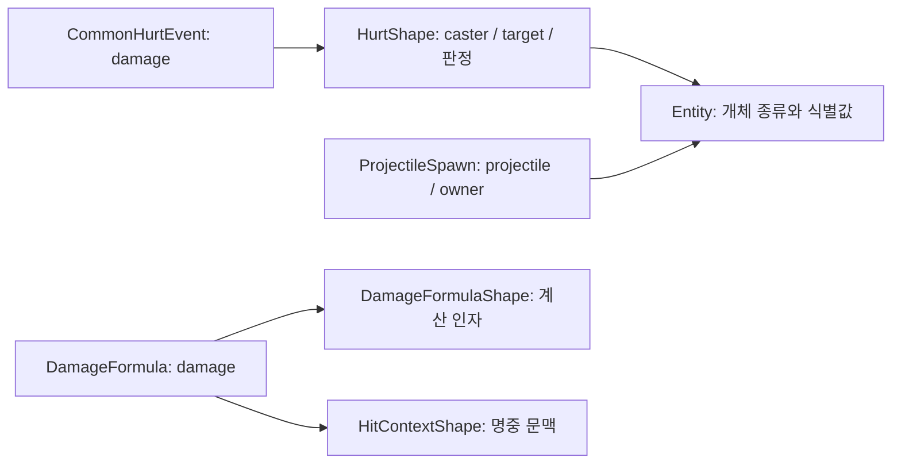

# BattleLog 전체 해설 — 읽는 법과 62종·240필드 사전

후속 관측은 [울트라 교체 무기·관통·샷건](BATTLE_LOG_ULTRA_WEAPON_OBSERVATION.md)에 기록했다. 아래 횟수는 최초 표본 기준이다. 후속 표본에서 실제 교체 사격과 1발·4부위 타격을 확인했으며, 계산/적용 이벤트의 단순 역순 연결은 관통에서 성립하지 않았다. 부위까지 확인한 유일 대응만 계수 결합에 사용한다.

작성일: 2026-09-19. 기준: 로컬 152.8.11 클라이언트에서 확보한 솔로 레이드 Challenge 완주 로그.

**BattleLog는 전투가 진행되는 동안 생긴 사건과 계산에 사용한 값을 순서대로 담은 기록이다.** 대미지뿐 아니라 공격자·대상, 치명타·코어 판정, 버스트, 탄약, 재장전, 회복, 효과 변화, 몬스터 행동과 투사체 생성도 들어 있다. 영상이나 프레임별 전체 게임 상태를 저장한 파일은 아니다.

현재 파일의 **62종 정의와 그 안의 240개 필드**를 아래에 모두 설명했다. 실제로 발생한 것은 46종, 168,842개 레코드다. 나머지 16종은 정의만 있으므로 설명 가능한 범위가 다르다. 추가 능력치 목록의 12개 키도 별도로 설명한다.

## 목차

- [후속 조사에서 새로 확인한 내용](#후속-조사에서-새로-확인한-내용)
- [먼저 읽을 핵심](#먼저-읽을-핵심)
- [어떤 분석을 할 수 있나](#어떤-분석을-할-수-있나)
- [파일과 JSON을 읽는 법](#파일과-json을-읽는-법)
- [시간과 숫자 단위](#시간과-숫자-단위)
- [참조 사전과 숫자 코드](#참조-사전과-숫자-코드)
- [추가 능력치 12개](#추가-능력치-12개)
- [전체 이벤트 및 필드 사전](#전체-이벤트-및-필드-사전)
- [아직 확정하지 못한 부분](#아직-확정하지-못한-부분)
- [근거 파일과 적용 범위](#근거-파일과-적용-범위)

## 통계 설계 전 확정 감사

2026-09-19 심화 조사 결과를 각 필드 설명에 반영했다. 전체 판정·정량 근거·미확정 사유는 **[확정 감사와 남은 근거](BATTLE_LOG_CERTAINTY_AUDIT.md)**에 정리했다. 아래 후속 조사 절과 항목별 사전은 이번 결과로 갱신한 현재 설명이다.

| 새로 확인한 관계 | 검증 범위 |
|---|---|
| 실제 회복 = min(회복량, HP 부족분) | 초기화·피해·회복·능력치 변경을 재구성한 12,621건 전부 일치 |
| 수신 피해 actual의 잔여 HP 제한 | 초기 HP를 추적한 보스/방벽 7,745건 전부 일치 |
| isDamageApplied=false도 유효 피해 경로 | OnEntityGetDamage 7,788건 모두 같은 틱의 공통 피해와 연결. 미연결 공통 피해 1건은 별도 보존 |
| 버스트 에너지 100%=1,000,000 | 로컬 원본 설정과 버스트 진입 14회가 일치. 충전 발생량과 실제 수용량은 구분 |
| 버스트 스킬 사용 | 42회 모두 같은 캐릭터 단계 전환과 연결, 사용 기록이 68~86ms 먼저 발생 |
| CriticalDamage÷10,000 | 비중립 치명타 계산 8,302건 모두 일치. 31건은 같은 틱 뒤의 능력치 갱신에 대응 |
| 광폭화 value=누적 보스 피해 임계값 | 초기 0 이후 8개 임계값 모두 같은 틱의 다음 타격에서 통과 |
| 피해 공식의 관측 영역 재현 | 1,009종 입력 중 978종, 30,608건 중 30,490건 정확 일치. 나머지 최대 오차 4 |

**필드 형식을 모두 해석한 것과 모든 내부 동작을 확정한 것은 다르다.** 62종·240개 고정 필드의 설명은 갖췄지만, 그중 16종·38필드는 실전 표본이 없고 계산 인자 36개 중 22개는 고정값이었다. 같은 표본에 맞춘 공식은 독립 검증된 원본 공식으로 취급하지 않는다.

## 후속 조사에서 새로 확인한 내용

2026-09-19 추가 조사. 새 전투나 클라이언트 변경 없이 기존 로그와 로컬 152 정적 데이터만 대조했다. 아래 ‘확인’은 해당 표본과 데이터에 대한 확인이며 모든 버전의 내부 구현 계약이라는 뜻은 아니다.

| 항목 | 이전 상태 → 이번에 확인한 내용 |
|---|---|
| `rawCaster` | 정체 미확정 → 값이 있는 50건 모두 **실제 보스 투사체**. `ProjectileSpawn.owner == HurtShape.caster`가 50건 모두 성립 |
| `Function.functionId` | 효과 관련 ID 추정 → **93개 모두 FunctionTable.Id에 정확히 연결** |
| `UseCharacterSkill.characterSkillId` | 스킬 관련 ID 추정 → **92건 모두 CharacterSkillTable의 9개 행에 연결** |
| `sourceKind/sourceId` | 테이블 미확정 → 1은 캐릭터 스킬, 2는 효과. 0의 캐릭터 측은 발사 설정. 보스 측 두 문맥은 sourceId=0으로 원천 식별값 없음 |
| 시간형 효과의 `remainBits` | 단위 미확정 → float32로 읽은 값의 **1단위=10ms=0.01초**. 적용 범위는 TimeSec |
| 계산값과 공통 피해의 불일치 | 원인 미확정 → 같은 틱 불일치 124쌍 모두 **면역 플래그 + 공통 피해 0** |
| 틱이 다른 피해 사건 | 연결 미확정 → 45건 모두 캐릭터 스킬 원천. 이전 계산과 공격자·대상·피해량이 맞지만 일부 타격의 후보는 복수 |
| `ammoDelta` | 증감량 후보 → 캐릭터·발사 설정별 누적 31,415건 모두 정상 잔탄 범위. **잔탄의 증감량**으로 읽는 근거 확보 |
| `StopReload.timeMs` | 설정/경과시간 미확정 → StartReload와 188쌍 대조 결과 **해당 재장전 구간의 경과시간** 해석을 지지 |

### rawCaster: 보스와 보스가 쏜 탄을 구분

```text
HurtShape.caster         = 피해의 주체인 보스
CommonHurtEvent.rawCaster = 실제로 날아와 피해를 전달한 투사체
ProjectileSpawn.owner    = 그 투사체를 발사한 보스
```

이 연결은 rawCaster가 지정된 50건 모두에서 성립했다. `rawCaster`로 공격자 귀속을 무조건 바꾸면 보스 피해가 ‘투사체의 피해’로 분리될 수 있다. 분석 목적에 따라 주체와 전달 개체를 둘 다 보존한다. `-1`은 계속 미지정으로 둔다.

### 피해 원천 코드: 출처와 기록 시점이 구분됨

| sourceKind | 연결된 원본 테이블 | HitContextShape 개수 |
|---:|---|---:|
| 0 | 캐릭터 측 CharacterShotTable | 13 |
| 0 | 보스 측 sourceId=0, 원천 식별값 없음 | 2 |
| 1 | CharacterSkillTable | 4 |
| 2 | FunctionTable | 7 |

총 26개 문맥을 분류했다. 보스 측 두 문맥은 sourceId가 실제로 0이다. 유효 스킬 ID를 다른 테이블에서 찾는 문제가 아니라 원천 식별값이 기록되지 않은 경우다. `sourceKind=0` 전체를 CharacterShotTable로 강제하지 않는다.

`HurtShape.damageType`도 정식 enum 이름 대신, 확인한 발생 경로로 구분할 수 있다.

| 코드 | 이번 표본에서 연결한 경로 | 사건 수 |
|---:|---|---:|
| 1 | 캐릭터 일반 발사 설정 / 보스 발사 계열 | 30,158 |
| 2 | 캐릭터 스킬 InstantAll·InstantSequentialAttack | 38 |
| 3 | 캐릭터 스킬 InstantNumber | 7 |
| 4 | FunctionTable의 Damage 효과 | 405 |

코드 2와 3의 일반적 차이를 ‘스킬1/스킬2’ 등으로 이름 붙일 근거는 없다. 또한 **로그의 `UseCharacterSkill.skillType`과 정적 `CharacterSkillTable.SkillType`은 다른 코드 체계**다. 같은 로그 코드에 SetBuff, InstallBarrier, InstantNumber가 함께 대응했다.

### 피해 연결: 면역과 지연을 분리

같은 틱·공격자·대상을 기준으로 가장 최근의 미소비 DamageFormula를 CommonHurtEvent에 연결한 결과:

- 30,563쌍 중 30,439쌍: 피해량 일치.
- 나머지 124쌍: 계산 피해는 양수, 공통 피해는 0, `isImmune=true`.
- 같은 틱에서 연결되지 않은 45건: 모두 캐릭터 스킬 계열. 앞선 다른 틱에 공격자·대상·피해량이 일치하는 계산이 존재.

45건 중 23건은 그 단계의 앞선 미소비 후보가 하나였고, 22건은 동일 피해값이 반복돼 여러 후보가 있었다. 따라서 **모든 타격을 인과적으로 유일하게 짝지었다고 주장하지 않는다.** 45건을 모두 소비하는 한 가지 일관된 연결은 만들 수 있지만 정확한 타격별 지연시간은 일부 미확정이다. 이렇게 만든 대응의 지연 범위는 120~2,516ms이며, 복수 후보의 정확한 지연시간으로 확정해 쓰지 않는다.

면역 124건의 `isDamageApplied`는 모두 true였다. 반대로 false인데 양수 피해가 기록되는 사건도 있다. 이 플래그를 ‘딜 합계에 넣을지’의 필터로 사용하지 않는다. **면역 이후 피해와 계산 단계 피해가 다를 수 있다는 구체적 사례**를 확보한 것이다.

### 시간 단위: TimeSec의 정수는 그대로 초가 아님

`FunctionRemainAtTickEnd` 2,271건은 모두 정적 효과의 `DurationType=TimeSec`에 연결됐다. 지속시간이 0이 아닌 유한 효과의 생성/제거 구간 572건은 설정값×10ms와 전부 62ms 이내에 맞았고, 설정값×1ms와 맞는 건은 없었다.

실제 경과시간이 양수인 잔여값 관측 542건 중 537건은 `(설정값 − 잔여값) × 10`과 경과 ms가 0.3ms 이내에서 일치했다. 효과 갱신 시점·틱 내 처리 순서·큰 float32의 정밀도 때문에 모든 행에 정확히 같은 등식이 성립한다고 단정하지 않는다.

```text
TimeSec 효과의 남은 초 = float32(remainBits) / 100
TimeSec 효과의 남은 ms = float32(remainBits) * 10
```

효과 테이블에는 TimeSec 외에도 Shots와 Battles가 실제로 있었다. 그런 지속 조건의 DurationValue를 모두 시간으로 바꾸면 안 된다. BurstChange.duration=1000도 풀 버스트 약 10초와 맞지만 다른 단계의 세부 의미까지 자동 확정하지 않는다.

### 탄약·재장전 및 치명타 보정

- `ammoDelta`를 `(캐릭터, shotId)`별로 초기 0부터 누적한 결과, 31,415건 전부 `0 ≤ 잔탄 ≤ maxAmmo`였다. 로그가 전투 시작을 포함할 때의 관측이며, 중간부터 잘린 로그에는 초기 잔탄 복원이 필요하다.
- `isUse=true`인 대부분은 음수 delta였으나 양수 1건도 있었다. 발사 횟수나 소모량은 이 플래그만으로 세지 않는다.
- `StopReload.timeMs`와 같은 캐릭터의 StartReload부터 누적한 시간은 188쌍 중 153쌍이 1ms 이내, 전체가 24ms 이내로 맞았다. 고정 설정 시간보다 실제 해당 구간의 경과시간이라는 해석을 지지한다.
- 치명타 계산 8,302건 중 8,271건은 현재 `CriticalDamage / 10000`이 `criticalDamageRateBits`를 실수로 읽은 값과 일치했다. 나머지 31건도 같은 틱 뒤에 출력된 StatChanged 값으로 전부 설명됐다. 따라서 단순히 로그상 직전 능력치만 사용하는 재계산은 피한다.

### 계속 남겨둔 미확정

헤더의 두 숫자, 바깥 context의 공식 계약, Generic의 정식 코드명, 자세·몬스터 조건 코드의 정확한 이름, 전체 피해 계산의 연산 순서는 여전히 미확정이다. 로컬 `global-metadata.dat`는 0바이트였고 기존 디스크 심볼 조사에서도 필요한 로그 작성 코드의 이름이 확인되지 않았다. 따라서 이름·인접 사건만으로 빈칸을 채우지 않았다.

## 먼저 읽을 핵심

1. **투사체에 입힌 피해를 캐릭터별로 구분할 수 있었다.** `ProjectileSpawn`으로 투사체를 찾고, `CommonHurtEvent → HurtShape → caster/target`을 따라가 분류했다. 실제 5명 귀속이 해소됐고, 합계가 보고서의 투사체 피해 총량과 일치했다. 현재 확인 범위는 확보한 전투다.
2. **대미지 이벤트를 전부 더하면 안 된다.** `DamageFormula`, `CommonHurtEvent`, `OnEntityGetDamage`는 같은 공격의 서로 다른 처리 단계이거나 적용 범위가 다를 수 있다. `actual`도 결과창 총 대미지의 대체값이 아니다.
3. **`…Bits`는 피해량이나 큰 정수가 아니다.** 32비트 실수의 비트 표현이다. 비트 재해석으로 실수 값을 얻는다.
4. **`caster=0`은 첫 개체를 가리킬 수 있다.** 0은 유효한 사전 참조다. 일부 선택적 참조의 `-1`을 미지정으로 구분한다.
5. **정의가 있다는 것과 실제로 기록됐다는 것은 다르다.** 이번 전투에서 발생하지 않은 부활·사망·아레나 등의 동작까지 실증된 것은 아니다.

### 설명의 확실성

| 구분 | 뜻 |
|---|---|
| 확인 | 바이트를 끝까지 해석한 결과, 사전 참조 대조, 기존 전투 보고서와의 일치 등으로 확인한 사실 |
| 해석 / 추정 | 필드 이름과 관측 양상에 맞는 설명. 클라이언트 내부 구현의 공식 계약으로 단정하지 않음 |
| 미확정 | 정식 enum 이름, 정확한 단위·계산 순서, 미발생 사건 등 근거가 부족한 부분 |

이 문서는 **필드를 빠짐없이 다루는 해설**이지, 원본 계산식을 전부 역산했다는 선언이 아니다. 아래 한국어 제목도 독해용 설명이며 공식 용어라고 주장하지 않는다.

## 어떤 분석을 할 수 있나

| 궁금한 내용 | 따라갈 기록 | 현재 해석 수준 |
|---|---|---|
| 누가 누구에게 피해를 줬나 | CommonHurtEvent → HurtShape → Entity | 표본에서 참조 해소 확인 |
| 캐릭터별 투사체 피해 | ProjectileSpawn 집합 + 위 경로 | 5명 귀속 및 보고서 총량 일치 확인 |
| 치명타·코어·사거리·관통 | HurtShape 플래그 | 필드 존재 확인. 플래그별 세부 판정 차이는 일부 미확정 |
| 그 타격의 공격력·방어력·보정 | DamageFormula → DamageFormulaShape | 인자와 float32 해석 확인. 전체 공식의 연산 순서는 미확정 |
| 버스트 사용 순서 | BurstChange, UseCharacterSkill | 단계 흐름 확인. skillIndex를 3개 버튼으로 단순화 불가 |
| 탄약·재장전·무기 전환 | ChangeAmmo, GainAmmo, Start/StopReload, ChangeWeapon | 사건·수치 확인. 발사 수와 일대일 아님 |
| 회복·방벽·효과 변화 | CharacterTakeHeal, AddedBarrier, Function 계열, StatChanged | 기록 확인. 처리 단계가 다른 합계는 분리 |
| 보스 공격과 투사체 생성 시점 | MonsterAttack/Fire 계열, ProjectileSpawn, TickClock | 순서와 시간 증가량 확인. 행동/리소스 코드 이름은 별도 매핑 필요 |
| 모든 패턴·모션을 그대로 재생 | 로그 전체 | 보장하지 못함. 위치·회전의 전체 시계열, 자산, 모든 난수 상태를 제공한다는 근거 없음 |

### 대미지 기록의 관계



투사체 피해를 분리한 방법은 다음과 같다.

```text
투사체 집합 = ProjectileSpawn.projectile의 Entity 참조 집합

각 CommonHurtEvent에 대해:
  h = HurtShape[shape]
  h.target이 투사체 집합에 들어 있으면:
    h.caster를 편성 캐릭터의 로컬 UUID와 슬롯으로 해소
    해당 캐릭터의 투사체 피해에 damage를 누적
```

이번 표본에서는 이 방식의 개인별 합이 `Monster.Hp.TotalProjectileDamageReceived`와 일치했고, 캐릭터가 보스에게 가한 공통 피해 합계는 결과 요청 총 대미지와 일치했다. 이 관측을 모든 소환물·분배 피해의 귀속 규칙으로 자동 확대하지 않는다. 해소할 수 없는 시전자는 `unresolved`로 남긴다.

기존 TAB 딜표 공식과 DB 필드는 [레이드 개인별 대미지 수집](../../archive/raid-records/RAID_DAMAGE_CAPTURE.md)을 따른다. `Skill.TotalDamage`를 TAB 값에 추가로 더하지 않는다. **이 문서 작성으로 투사체 개인딜 DB 저장이나 UI가 추가된 것은 아니다.** 현재는 원본 확보와 사후 해석 결과다.

## 파일과 JSON을 읽는 법

### 원본 파일 구조

확보한 원본은 121,396바이트다. 앞부분에 이벤트 정의를 가진 헤더가 있고, 뒷부분은 raw DEFLATE 압축 본문이다. 전체가 JSON이나 gzip 파일인 것은 아니다.

```text
헤더 길이: unsigned base-128 varint
헤더:
  의미 미확정 숫자 (표본 32)
  길이 + UTF-8 클라이언트 빌드 문자열
  의미 미확정 숫자
  능력치 이름 12개
  이벤트 정의 62개
    이름 / 필드 수 / 필드 이름들 / 추가 능력치 플래그
본문:
  raw DEFLATE 압축 이벤트 스트림
```

이번 파일은 길이 접두부 2바이트 + 헤더 3,731바이트 뒤, 오프셋 3,733에서 압축 본문이 시작했다. 압축 본문은 117,663바이트, 해제 결과는 1,523,468바이트다. 해제 후 끝까지 168,842개 레코드로 해석했고 남는 바이트가 없었다. **이 오프셋·정의 수를 다른 버전에 하드코딩하면 안 된다.**

레코드 해석 순서는 다음과 같다.

```text
정의 번호: unsigned varint
레코드 공통 context: unsigned varint
각 정의의 필드: ZigZag signed varint, 헤더의 필드 순서대로
추가 능력치 플래그가 있으면:
  항목 수: ZigZag signed varint
  반복 (능력치 키 번호, 값): 각각 ZigZag signed varint
```

ZigZag 변환은 `signed = (unsigned >> 1) ^ -(unsigned & 1)`이다. 외부 메시지의 BattleLog는 protobuf `bytes`이지만, 내부 스트림을 일반 protobuf 메시지라고 가정해서는 안 된다.

### 디코딩한 JSON의 바깥 필드

| 키 | 의미 |
|---|---|
| `event` | 헤더 정의 번호를 이름으로 변환한 이벤트 종류 |
| `context` | 모든 레코드 앞에 있는 공통 값. 표본에서 0/1이고, 1은 TickClock에서만 관측됨. 틱 진행 관련 값으로 추정 |
| `values` | 해당 이벤트의 실제 필드 값 |
| `extra` | 추가 능력치 목록을 디코더가 별도 객체로 표시한 것. 키는 능력치 이름 배열의 번호 |
| `offset` | 압축 해제된 본문에서의 레코드 시작 바이트 위치. 디코더가 붙인 탐색 정보이며 시간·게임 좌표가 아님 |

`DamageFormula.values.context`는 **HitContextShape 참조**다. 바깥 `context`와 같은 뜻이 아니다. `extra`와 `offset`이라는 이름은 원본 이벤트 필드 목록이 아니라 분석용 JSON 구조에 붙인 이름이다.

## 시간과 숫자 단위

### 시간

| 값 | 관측 / 읽는 방법 |
|---|---|
| TickClock 건수 | 11,837개. 곧바로 60fps의 영상 프레임 수라는 뜻은 아님 |
| playTimeDeltaMs 합 | 180,146ms |
| dtMs 합 | 180,165ms |
| realtimeDeltaMs 합 | 292,020ms |
| 결과 보고서의 전투 시간 | 180,000ms |

게임 진행 시간과 현실 경과 시간은 다르다. 이벤트 시점을 그릴 때는 누적 `playTimeDeltaMs` 등 **선택한 시간축을 명시**하고, 결과 보고서 시간은 별도로 보존한다. 한 틱 안의 이벤트 순서는 알 수 있어도 각각의 정확한 소수점 시각이 모두 저장됐다는 뜻은 아니다.

`BurstChange.duration`은 `Ms` 접미사가 없다. 표본에서 1000인 풀 버스트 구간이 약 10초 지속됐으므로 10ms 단위일 가능성이 있지만 아직 내부 계약을 확인하지 못했다. 단순히 1000ms로 변환하지 않는다. `FunctionRemainAtTickEnd.remainBits`는 후속 정적 테이블·실제 수명 대조로, 이번 표본의 TimeSec 효과에서 1단위=10ms임을 확인했다. float32 표현과 시간 단위는 별도로 해석한다.

### Bits → 실수 변환

```python
import struct

def bits_to_float32(raw):
    return struct.unpack('<f', struct.pack('<I', raw & 0xffffffff))[0]

# 비트 표현의 설명용 예
assert bits_to_float32(1065353216) == 1.0
assert bits_to_float32(1073741824) == 2.0
```

`float(raw)`로 숫자 형식만 바꾸거나 모든 값을 10,000으로 나누는 방식은 틀리다. 현재 관측된 모든 `…Bits`는 32비트에 들어가고 이 변환 후 유한 실수로 읽혔다. 향후 입력은 범위·NaN·Infinity를 따로 검사해야 한다.

`Rate`가 들어가도 모두 같은 종류의 곱셈 계수는 아니다. 예를 들어 `damageReductionRateBits`는 음수도 나타났다. `DamageFormulaShape` 전체를 곱하는 방식으로 원본 공식을 만들 수 없다. 큰 피해량은 정수로 유지하고, JSON을 JavaScript로 읽을 때 안전 정수 범위를 넘는 값은 문자열/BigInt 등으로 보존해야 한다.

## 참조 사전과 숫자 코드

### 참조 사전 5개

| 사전 | 표본 항목 수 | 사용하는 필드 |
|---|---:|---|
| Entity | 185 | caster, target, owner, char, monster, projectile 등 |
| Function | 93 | func |
| HurtShape | 348 | CommonHurtEvent.shape |
| DamageFormulaShape | 1,009 | DamageFormula.shape |
| HitContextShape | 26 | DamageFormula.context |

각 사전은 **자기 종류의 등록 순서에 따라 0부터 번호를 매긴다.** 전체 이벤트 순번이나 entityId를 사전 번호로 사용하지 않는다. 정의보다 참조가 먼저 나오는 경우가 실제로 있으므로 다음처럼 두 번 읽는다.

1. 전체 스트림에서 사전 항목을 원래 순서대로 모은다.
2. 모든 사전이 준비된 뒤 각 이벤트의 참조를 해소한다.

전체 사전 수집 뒤 검사한 참조는 `-1` 선택적 참조를 제외하고 범위에 들어왔다. 최초 조작 캐릭터의 이전 대상, 일부 파츠 파괴 공격자, 일부 버스트 전환 사용자에 `-1`이 있었다. 아직 등장하지 않은 정의를 첫 읽기에서 바로 손상 데이터로 판단하면 안 된다.

### Entity.kind — 개체 종류

| 코드 | 표본 개수 | 확인한 연결과 해석 |
|---:|---:|---|
| 1 | 5 | LoadCharacterObject의 5명. 캐릭터 |
| 2 | 1 | MonsterInitResource. 이 전투의 보스 |
| 3 | 99 | 소환물 계열. 그중 70개는 AddedSummonObject와 AddedBarrier가 같은 개체를 가리킴 |
| 4 | 69 | ProjectileSpawn의 69개와 정확히 일치. 투사체 |
| 5 | 5 | ObjectInit으로 초기화. 세부 종류 미확정; 엄폐물이라고 단정하지 않음 |
| 6 | 2 | ObjectInit으로 초기화. 세부 종류 미확정 |
| 8 | 4 | 세부 종류 미확정 |

관측하지 않은 코드를 추정해서 채우지 않는다. 또한 `HitContextShape.casterKind/targetKind`는 이 표와 다른 코드 체계다. 관측상 targetKind=1은 kind=3 대상, targetKind=2는 kind=4 대상에 대응했고, targetKind=0에는 여러 종류가 섞였다.

### 버스트 단계와 부위 유형

로컬 Epinel 정적 데이터 코드의 `BurstStep`은 `None=0`, `Step1=1`, `Step2=2`, `Step3=3`, `StepFull=4`로 정의되어 있다. 실제 BurstChange 전환과 대응하므로 독해 시 대기→버스트1→버스트2→버스트3→풀 버스트로 읽을 수 있다. 그 외 정의된 값은 이번 로그에서 확인하지 않았다.

로컬 `PartsType`에는 `None=0`, `Body=6`, `Weapon01=13`이 있다. 로그의 HitContextShape.partsType과 파츠 파괴의 parts 값을 이해할 후보지만, **로그 작성 코드가 이 enum을 직접 사용하는지까지 확인한 것은 아니다.** 이름과 숫자의 일치만으로 확정 매핑을 만들지 않는다.

후속 조사에서 `sourceKind`의 테이블 연결과 `damageType`의 발생 경로를 일부 확인했다. skillType의 표본 내 발생 경로도 추가 확인했다. 정식 enum 명칭 및 hitType, condition, Generic.eventType 등의 코드 이름은 여전히 미확정이다. 아래 사전에 관측 코드를 적더라도 그 숫자에 임의의 게임 용어를 붙이지 않는다.

## 추가 능력치 12개

`LoadCharacterObject`, `MonsterInitResource`, `AddedSummonObject`, `StatChanged`는 고정 필드 뒤에 추가 능력치 목록을 가진다. 아래 번호는 원본 게임 캐릭터 ID가 아니라 **현재 헤더에 들어 있는 능력치 이름 배열의 인덱스**다. 다른 헤더에서는 이름 배열을 다시 읽는다.

| 번호 | 이름 | 읽는 뜻과 한계 |
|---:|---|---|
| 0 | MaxHP | 최대 HP |
| 1 | HP | 현재 HP |
| 2 | Attack | 공격력 |
| 3 | Defence | 방어력 |
| 4 | CriticalRatio | 치명타 확률 관련 값. 표시 퍼센트로의 환산 단위 미확정 |
| 5 | NormalCriticalRatio | 일반 공격 치명타 확률 관련 값으로 해석. CriticalRatio와의 합성 방식 미확정 |
| 6 | CriticalDamage | 치명타 계산 계수는 값÷10,000. 8,302건 중 8,271건은 직전 능력치와 일치하고 31건은 같은 틱 뒤에 기록된 변경값과 일치했다. 계산 시점과 로그 출력 순서를 구분 |
| 7 | Attention | 주목도/공격 대상 선정 관련 수치로 해석. 정확한 효과 미확정 |
| 8 | DamageShare | 피해 공유·분배 관련 값으로 해석. 단위·분배 대상 미확정 |
| 9 | HealShare | 회복 공유·분배 관련 값으로 해석. 단위·분배 대상 미확정 |
| 10 | StatDamageRatio | 값÷10,000이 계산 계수와 30,602/30,608건 일치. 보스 계산 6건은 예외. Bits 계수와 저장 표현을 구분하고 타격 입력은 DamageFormulaShape를 우선 |
| 11 | MaxAmmo | 최대 탄약량 |

추가 능력치 목록은 늘 12개라는 뜻이 아니다. 이번 `StatChanged`는 한 번에 1~6개 키만 포함했다. **기록된 키만 새 값으로 갱신하고 나머지는 이전 상태를 유지**하는 방식으로 읽는다. 초기화 목록과 변경 목록을 구분한다.

## 전체 이벤트 및 필드 사전

헤더의 정의 순서대로 0~61번을 적었다. 이 번호는 이 파일의 정의 번호이며 다른 빌드의 고정 API 번호가 아니다. 발생 수는 사전 정의 레코드까지 포함한 본문 건수다.

필드 설명에서 ‘참조’는 위 사전 번호를 뜻한다. 미발생 이벤트는 참조 구조도 이름에 따른 해석이며 실측 검증으로 취급하지 않는다. 아래 관측 코드는 enum의 정식 명칭을 확정한 것이 아니다.

| 찾아볼 내용 | 이벤트 바로가기 |
|---|---|
| 시간·공통 구조 | [TickClock](#event-00) · [ArenaRoundHeader](#event-46) · [Generic](#event-49) · [Entity](#event-50) · [ObjectInit](#event-51) · [Function](#event-52) · [TickSkip](#event-59) |
| 대미지·판정·계산 인자 | [CommonHurtEvent](#event-42) · [OnEntityGetDamage](#event-43) · [StatisticsTakeDamage](#event-44) · [DamageFormula](#event-47) · [FunctionDamageBasis](#event-48) · [HurtShape](#event-53) · [DamageFormulaShape](#event-54) · [HitContextShape](#event-55) |
| 효과·능력치·회복 | [AddedFunction](#event-01) · [AddedIterationFunction](#event-02) · [RemovedFunction](#event-03) · [DispelledFunction](#event-04) · [StatChanged](#event-05) · [ResurrectionCharacter](#event-06) · [CharacterTakeHeal](#event-23) · [StatisticsTakeHeal](#event-45) · [FunctionRemainAtTickEnd](#event-58) · [ChangedFunctionRemainTime](#event-60) · [DurationValueChange](#event-61) |
| 버스트·스킬·조작 | [BurstChange](#event-07) · [BurstCharge](#event-08) · [ChangedFocusCharacter](#event-13) · [ChangedCharacterStance](#event-14) · [ChangeAutoMode](#event-15) · [UseCharacterSkill](#event-16) · [UseCharacterSkillTarget](#event-17) · [CharacterDead](#event-22) · [LoadCharacterObject](#event-24) |
| 탄약·재장전·무기·차지 | [ChangeAmmo](#event-18) · [GainAmmo](#event-19) · [StartReload](#event-20) · [StopReload](#event-21) · [ChangeWeapon](#event-40) · [ChargeStart](#event-57) |
| 방벽·소환물·투사체 | [AddedBarrier](#event-09) · [RemovedCharacterBarrier](#event-10) · [AddedCharacterDecoy](#event-11) · [DestroySummon](#event-12) · [AddedSummonObject](#event-41) · [ProjectileSpawn](#event-56) |
| 몬스터·파츠·행동 | [MonsterInitResource](#event-25) · [MonsterDestroy](#event-26) · [MonsterStun](#event-27) · [MonsterPartsDestory](#event-28) · [BerserkStepUp](#event-29) · [MonsterAttack](#event-30) · [MonsterFireCasting](#event-31) · [MonsterFire](#event-32) · [MonsterTimelineAttack](#event-33) · [MonsterSkillInterruptionEvent](#event-34) · [MonsterBTInterruptionEvent](#event-35) · [MonsterCondition](#event-36) · [MonsterDash](#event-37) · [MonsterJump](#event-38) · [MonsterTeleport](#event-39) |

<a id="event-00"></a>

### 00. TickClock — 시간 진행

발생 **11,837건**.

| 필드 | 설명 |
|---|---|
| `playTimeDeltaMs` | 플레이 시간 증가량, ms. 결과창 경과시간을 추적할 때 우선 볼 후보지만 보고서 시간과 완전히 같지는 않다. |
| `dtMs` | 틱 처리에 사용되는 시간 증가량, ms. playTimeDeltaMs와 미세한 차이가 관측됐다. |
| `realtimeDeltaMs` | 실시간 증가량, ms. 대기·지연을 포함할 수 있으므로 전투 시간과 구분한다. |

<a id="event-01"></a>

### 01. AddedFunction — 효과 부여

발생 **2,251건**.

| 필드 | 설명 |
|---|---|
| `caster` | 시전자/공격 주체의 `Entity` 참조. |
| `owner` | 소유자 또는 효과가 붙어 있는 개체의 `Entity` 참조. 시전자와 같다는 뜻은 아니다. |
| `func` | `Function` 사전 참조. 원본 효과 ID 자체가 아니다. |
| `stack` | 부여되는 효과의 스택 값으로 해석. 현재 누적 총량인지 증분인지는 미확정. |

<a id="event-02"></a>

### 02. AddedIterationFunction — 반복형 효과 부여

발생 **2,120건**.

| 필드 | 설명 |
|---|---|
| `caster` | 시전자/공격 주체의 `Entity` 참조. |
| `owner` | 소유자 또는 효과가 붙어 있는 개체의 `Entity` 참조. 시전자와 같다는 뜻은 아니다. |
| `func` | `Function` 사전 참조. 원본 효과 ID 자체가 아니다. |
| `stack` | 부여되는 효과의 스택 값으로 해석. 현재 누적 총량인지 증분인지는 미확정. |

<a id="event-03"></a>

### 03. RemovedFunction — 효과 제거

발생 **2,135건**.

| 필드 | 설명 |
|---|---|
| `owner` | 소유자 또는 효과가 붙어 있는 개체의 `Entity` 참조. 시전자와 같다는 뜻은 아니다. |
| `func` | `Function` 사전 참조. 원본 효과 ID 자체가 아니다. |

<a id="event-04"></a>

### 04. DispelledFunction — 효과 해제

발생 **0건** — 헤더 정의만 확인; 실제 값·동작 미관측.

| 필드 | 설명 |
|---|---|
| `caster` | 시전자/공격 주체의 `Entity` 참조. |
| `target` | 대상 개체의 `Entity` 참조. |
| `func` | `Function` 사전 참조. 원본 효과 ID 자체가 아니다. |

<a id="event-05"></a>

### 05. StatChanged — 능력치 변경

발생 **427건**.

추가 능력치 목록에 나타난 키만 갱신한다. 생략된 키를 0으로 초기화하면 안 된다. 같은 틱의 계산 입력이 먼저 기록되고 변경 능력치가 나중에 기록되는 경우가 확인됐다. 해당 타격의 계산 입력은 DamageFormulaShape를 우선한다.

| 필드 | 설명 |
|---|---|
| `owner` | 변경된 능력치의 주인 `Entity` 참조. 새 값은 뒤의 추가 능력치 목록에 들어 있다. |

고정 필드 다음에 **추가 능력치 목록**이 붙는다. 위 12개 키 사전 참조.

<a id="event-06"></a>

### 06. ResurrectionCharacter — 캐릭터 부활

발생 **0건** — 헤더 정의만 확인; 실제 값·동작 미관측.

명세만 있으며 이번 전투에는 부활 기록이 없다.

| 필드 | 설명 |
|---|---|
| `caster` | 시전자/공격 주체의 `Entity` 참조. |
| `target` | 대상 개체의 `Entity` 참조. |
| `value` | 부활에 관련된 수치. 부활 HP의 절대량인지 비율인지는 기록이 없어 미확정. |

<a id="event-07"></a>

### 07. BurstChange — 버스트 단계 변경

발생 **69건**.

관측 순서는 0→1→2→3→4→0의 반복이다. 단계 번호를 시간이나 사용 횟수로 읽지 않는다.

| 필드 | 설명 |
|---|---|
| `before` | 변경 전 버스트 단계. 아래 단계 코드표 참조. 관측 코드: `0, 1, 2, 3, 4`. |
| `next` | 변경 후 버스트 단계. 아래 단계 코드표 참조. 관측 코드: `0, 1, 2, 3, 4`. |
| `camp` | 진영 코드. 아군/적군이라는 개념과 별개로 코드의 정식 열거형 이름은 미확정. 관측 코드: `1`. |
| `useChar` | 해당 전환에서 스킬을 사용한 캐릭터 참조로 해석. `-1`이 관측된다. |
| `duration` | 단계의 유지/제한 시간 설정값. 1000인 풀 버스트가 약 10초에 대응하고 시간형 효과의 10ms 단위와도 맞는다. 1단위=0.01초 해석을 지지하지만 다른 단계까지 동일하다는 직접 구현 근거는 아직 없다. |

<a id="event-08"></a>

### 08. BurstCharge — 버스트 게이지 충전

발생 **30,643건**.

| 필드 | 설명 |
|---|---|
| `caster` | 시전자/공격 주체의 `Entity` 참조. |
| `value` | 발생한 버스트 에너지 증가량. 로컬 ConfigBattle.burst_energy_max=1,000,000이므로 value÷10,000은 게이지 퍼센트포인트 상당량이다. 14회 모두 누적 충전이 이 상한을 넘는 틱에 버스트 진입. 풀 버스트 중에도 기록되므로 실제 게이지에 수용된 충전량·현재 잔량과 동일시하지 않는다. |

<a id="event-09"></a>

### 09. AddedBarrier — 방벽 생성

발생 **70건**.

| 필드 | 설명 |
|---|---|
| `caster` | 시전자/공격 주체의 `Entity` 참조. |
| `barrier` | 방벽 개체의 `Entity` 참조. |
| `initHp` | 방벽 생성 시 HP. |

<a id="event-10"></a>

### 10. RemovedCharacterBarrier — 캐릭터 방벽 제거

발생 **67건**.

| 필드 | 설명 |
|---|---|
| `barrier` | 방벽 개체의 `Entity` 참조. |
| `isDestroy` | 파괴에 의한 제거인지 나타내는 플래그로 해석. 만료와의 정확한 구분은 추가 근거 필요. 관측값: `0, 1` (0=false, 1=true로 해석). |

<a id="event-11"></a>

### 11. AddedCharacterDecoy — 캐릭터 디코이 생성

발생 **0건** — 헤더 정의만 확인; 실제 값·동작 미관측.

| 필드 | 설명 |
|---|---|
| `caster` | 시전자/공격 주체의 `Entity` 참조. |
| `decoy` | 디코이 개체 참조로 해석. 이 표본에는 발생하지 않아 실제 참조 대상은 미확정. |

<a id="event-12"></a>

### 12. DestroySummon — 소환물 제거

발생 **96건**.

생성 기록이 있는 방벽의 제거 외에도 다른 소환 유형이 관측됐다. 모든 제거 사건을 방벽 파괴로 합치지 않는다. 유형 2는 방벽, 유형 9의 29건도 캐릭터 소유 소환물이었다. 9를 보스 투사체로 치환할 수 없으며 정식 종류는 남아 있다.

| 필드 | 설명 |
|---|---|
| `summon` | 소환물의 `Entity` 참조. |
| `owner` | 소유자 또는 효과가 붙어 있는 개체의 `Entity` 참조. 시전자와 같다는 뜻은 아니다. |
| `summonType` | 소환 유형 코드. 정식 코드 이름은 미확정. 관측된 유형과 방벽의 겹침만 아래에 설명한다. 관측 코드: `2, 9`. |
| `skillId` | 관련 원본 스킬 식별값. 정확히 어떤 스킬 테이블을 가리키는지는 별도 매핑 필요. |

<a id="event-13"></a>

### 13. ChangedFocusCharacter — 조작 캐릭터 변경

발생 **10건**.

| 필드 | 설명 |
|---|---|
| `fromChar` | 이전 조작 캐릭터 Entity 참조. 최초 변경에서는 `-1`이 관측된다. |
| `toChar` | 새 조작 캐릭터 Entity 참조. |

<a id="event-14"></a>

### 14. ChangedCharacterStance — 캐릭터 자세 변경

발생 **379건**.

| 필드 | 설명 |
|---|---|
| `char` | 해당 캐릭터의 `Entity` 참조. |
| `fromStance` | 변경 전 자세 코드. 표본의 탄약 사용 31,165건·차지 시작 130건은 모두 상태 2, 재장전 시작 188건은 상태 0이었다. 정식 enum과 상태 0의 전체 의미는 미확정. 관측 코드: `0, 2`. |
| `toStance` | 변경 후 자세 코드. 2는 사격/차지 중 관측되는 상태, 0은 재장전 시작 시 관측되는 상태다. 0을 재장전 전용 상태 또는 엄폐로 단정하지 않는다. 관측 코드: `0, 2`. |

<a id="event-15"></a>

### 15. ChangeAutoMode — 자동 조작 모드 변경

발생 **0건** — 헤더 정의만 확인; 실제 값·동작 미관측.

| 필드 | 설명 |
|---|---|
| `autoType` | 자동 조작 종류 코드. 자동 사격/버스트 등의 코드 매핑은 미확정. |
| `isOn` | 해당 자동 모드를 켰는지 나타내는 플래그로 해석. 실제 기록은 없음. |

<a id="event-16"></a>

### 16. UseCharacterSkill — 캐릭터 스킬 사용

발생 **92건**.

| 필드 | 설명 |
|---|---|
| `caster` | 시전자/공격 주체의 `Entity` 참조. |
| `skillIndex` | 표본에서 2는 기본 스킬2, 3은 버스트, 4/5/7은 효과가 호출하는 추가 스킬 슬롯에 대응. 버스트 42건은 같은 캐릭터의 단계 전환과 순서대로 연결되고 사용 기록이 68~86ms 먼저 발생했다. 관측되지 않은 슬롯은 추정하지 않는다. 관측 코드: `2, 3, 4, 5, 7`. |
| `skillType` | 로그 자체의 스킬 구분 코드. 표본에서 1=기본 스킬2 사용 11건, 2=UseCharacterSkillId 효과가 호출하는 추가 스킬 39건, 3=버스트 사용 42건으로 연결됐다. 정식 enum 이름·표본 외 스킬1/다른 유형은 미확정. CharacterSkillTable.SkillType과는 다른 코드 체계다. 관측 코드: `1, 2, 3`. |
| `characterSkillId` | 원본 CharacterSkillTable.Id. 스킬 사용 92건 모두 해당 테이블의 9개 행에 연결됐다. 캐릭터 도메인 UUID가 아니다. |

<a id="event-17"></a>

### 17. UseCharacterSkillTarget — 스킬 대상 기록

발생 **63건**.

| 필드 | 설명 |
|---|---|
| `caster` | 시전자/공격 주체의 `Entity` 참조. |
| `target` | 대상 개체의 `Entity` 참조. |
| `subId` | 하위 대상/판정 구분값으로 해석. 파츠 ID, 충돌체 번호 중 무엇인지 미확정. |
| `isCore` | 코어 관련 판정 여부. `HurtShape.isCoreHit`과 역할이 완전히 같은지는 미확정. 관측값: `0` (0=false, 1=true로 해석). |

<a id="event-18"></a>

### 18. ChangeAmmo — 탄약 상태 변경

발생 **31,415건**.

한 이벤트를 한 발로 세면 안 된다. 재장전·탄약 보충·무기 변경의 상태 갱신이 섞일 수 있다.

| 필드 | 설명 |
|---|---|
| `char` | 해당 캐릭터의 `Entity` 참조. |
| `isUse` | 탄약 사용 처리 경로와 관련된 플래그. true 대부분은 음수 증감이지만 양수 1건도 있으므로 isUse=true를 무조건 탄약 감소·발사 1회로 치환하지 않는다. 관측값: `0, 1` (0=false, 1=true로 해석). |
| `shotId` | 관련 원본 발사/무기 설정 식별값. 실제 탄환 개체 참조와 구분한다. |
| `ammoDelta` | 현재 탄약에 더할 부호 있는 증감량. (캐릭터, shotId)별로 초기 0에서 누적한 31,415개 갱신 모두 0~maxAmmo 범위 안에 들어왔다. 현재 잔탄 수 자체가 아니다. |
| `maxAmmo` | 해당 시점 최대 탄약량으로 해석. |

<a id="event-19"></a>

### 19. GainAmmo — 탄약 획득

발생 **167건**.

| 필드 | 설명 |
|---|---|
| `target` | 대상 개체의 `Entity` 참조. |
| `value` | 획득/보충한 탄약 수량으로 해석. ChangeAmmo와 중복 집계하지 않는다. |

<a id="event-20"></a>

### 20. StartReload — 재장전 시작

발생 **188건**.

| 필드 | 설명 |
|---|---|
| `char` | 해당 캐릭터의 `Entity` 참조. |
| `isStart` | 재장전 시작 여부 플래그. 이벤트 이름과 중복돼 보이지만 원값을 보존한다. 관측값: `1` (0=false, 1=true로 해석). |

<a id="event-21"></a>

### 21. StopReload — 재장전 종료

발생 **188건**.

| 필드 | 설명 |
|---|---|
| `char` | 해당 캐릭터의 `Entity` 참조. |
| `isComplete` | 정상 재장전 완료 여부. false라면 중단 가능성이 있으나 중단 사유는 이 필드에 없다. 관측값: `0, 1` (0=false, 1=true로 해석). |
| `timeMs` | 이번 재장전 구간의 경과시간으로 해석할 근거가 확보됐다. 같은 캐릭터 StartReload와 연결한 188쌍 중 153쌍이 누적 플레이 시간과 1ms 이내, 전체 차이는 24ms 이내였다. 재장전 설정상의 고정 소요시간과 구분한다. |

<a id="event-22"></a>

### 22. CharacterDead — 캐릭터 사망

발생 **0건** — 헤더 정의만 확인; 실제 값·동작 미관측.

| 필드 | 설명 |
|---|---|
| `char` | 해당 캐릭터의 `Entity` 참조. |
| `isLeader` | 사망 캐릭터가 리더인지 나타내는 플래그로 해석. 표본 기록 없음. |

<a id="event-23"></a>

### 23. CharacterTakeHeal — 캐릭터 회복

발생 **12,621건**.

StatisticsTakeHeal과 건수부터 다르다. 두 계열의 heal/actual을 합하면 중복 또는 다른 단계 혼합이 된다. HP 부족분 제한식은 12,621건 전부 재현했다. caster는 회복 주체이고 target은 수혜자이므로 주체별 회복과 받은 회복을 분리할 수 있다.

| 필드 | 설명 |
|---|---|
| `caster` | 시전자/공격 주체의 `Entity` 참조. |
| `target` | 대상 개체의 `Entity` 참조. |
| `heal` | HP 부족분 제한을 적용하기 전 회복량. 초기 능력치·HP 변경·피해를 재구성하면 12,621건 모두 actualHeal=min(heal, max(0, MaxHP−직전HP))로 일치한다. |
| `actualHeal` | HP 부족분만큼 제한한 유효 회복량. 12,621건의 HP 재구성에서 위 식과 전부 일치했다. heal과 더하지 않으며, 무효 회복량은 이 표본에서 heal−actualHeal로 구한다. |

<a id="event-24"></a>

### 24. LoadCharacterObject — 캐릭터 초기화

발생 **5건**.

5개 캐릭터가 관측됐다. 추가 능력치 목록을 초기값으로 사용한다.

| 필드 | 설명 |
|---|---|
| `char` | 해당 캐릭터의 `Entity` 참조. |
| `camp` | 진영 코드. 아군/적군이라는 개념과 별개로 코드의 정식 열거형 이름은 미확정. 관측 코드: `1`. |

고정 필드 다음에 **추가 능력치 목록**이 붙는다. 위 12개 키 사전 참조.

<a id="event-25"></a>

### 25. MonsterInitResource — 몬스터 초기화

발생 **1건**.

| 필드 | 설명 |
|---|---|
| `monster` | 해당 몬스터의 `Entity` 참조. |
| `level` | 해당 개체의 레벨. |
| `category1` | 몬스터 분류 코드. 표본값 1은 해당 모델의 CategoryType1 및 MonsterGeneration과 모두 다르다. 상위 분류/세대라고 이름 붙일 근거가 없어 미확정으로 보존. 관측 코드: `1`. |
| `category2` | 몬스터 분류 코드. 표본값 5는 해당 모델의 Grade=Boss와 같지만 모델이 1종뿐이므로 동일 enum이라는 결론은 아직 후보다. CategoryType2와는 다르다. 관측 코드: `5`. |
| `isTarget` | 주요/지정 대상인지 나타내는 플래그로 해석. 결과 집계 대상이라는 뜻인지는 미확정. 관측값: `1` (0=false, 1=true로 해석). |

고정 필드 다음에 **추가 능력치 목록**이 붙는다. 위 12개 키 사전 참조.

<a id="event-26"></a>

### 26. MonsterDestroy — 몬스터 제거

발생 **0건** — 헤더 정의만 확인; 실제 값·동작 미관측.

| 필드 | 설명 |
|---|---|
| `monster` | 해당 몬스터의 `Entity` 참조. |
| `attacker` | 공격자 `Entity` 참조로 해석. 파츠 파괴 표본에서는 모두 `-1`이라 공격자 미지정. |
| `result` | 제거/파괴 결과 코드. 정식 열거형 이름은 미확정. |

<a id="event-27"></a>

### 27. MonsterStun — 몬스터 기절

발생 **0건** — 헤더 정의만 확인; 실제 값·동작 미관측.

| 필드 | 설명 |
|---|---|
| `monster` | 해당 몬스터의 `Entity` 참조. |

<a id="event-28"></a>

### 28. MonsterPartsDestory — 몬스터 파츠 파괴

발생 **2건**.

Destory는 실제 헤더의 철자다. 문서나 디코더에서 Destroy로 자동 교정하면 원본 키와 달라진다.

| 필드 | 설명 |
|---|---|
| `monster` | 해당 몬스터의 `Entity` 참조. |
| `parts` | 파괴된 파츠 유형. 관측 2건 모두 13이며 해당 보스 모델의 MonsterPartsTable.PartsType=Weapon01과 일치. 원본 파츠 행 ID나 Entity 참조가 아니다. 표본 밖 유형 매핑은 별도 확인한다. |
| `attacker` | 공격자 `Entity` 참조로 해석. 파츠 파괴 표본에서는 모두 `-1`이라 공격자 미지정. |
| `result` | 제거/파괴 결과 코드. 정식 열거형 이름은 미확정. 관측 코드: `0`. |

<a id="event-29"></a>

### 29. BerserkStepUp — 광폭화 단계 증가

발생 **9건**.

| 필드 | 설명 |
|---|---|
| `next` | 변경 후 광폭화 단계로 해석. 관측 코드: `1, 2, 3, 4, 5, 6, 7, 8, 9`. |
| `max` | 최대 광폭화 단계로 해석. |
| `value` | 이번 표본에서 해당 단계에 도달하는 누적 보스 피해 임계값. 첫 단계는 0이며 나머지 8회 모두 직전 누적 피해 < value ≤ 다음 타격까지의 누적 피해, 전환과 다음 타격은 같은 틱이었다. 순간 타격량이나 현재 피해 합계가 아니다. |
| `stageLv` | 해당 단계의 스테이지/몬스터 레벨 관련 값으로 해석. 실제 능력치 적용 위치는 미확정. |

<a id="event-30"></a>

### 30. MonsterAttack — 몬스터 공격

발생 **53건**.

| 필드 | 설명 |
|---|---|
| `monster` | 해당 몬스터의 `Entity` 참조. |
| `target` | 대상 개체의 `Entity` 참조. |
| `targetType` | 공격 대상 선정 유형 코드. 정식 코드 이름은 미확정. |
| `aniNumber` | 공격 애니메이션 번호로 해석. 원본 애니메이션 리소스와의 연결은 별도 매핑 필요. |

<a id="event-31"></a>

### 31. MonsterFireCasting — 몬스터 발사 준비

발생 **62건**.

| 필드 | 설명 |
|---|---|
| `monster` | 해당 몬스터의 `Entity` 참조. |
| `skillId` | 관련 원본 스킬 식별값. 정확히 어떤 스킬 테이블을 가리키는지는 별도 매핑 필요. |
| `attackNode` | 발사를 수행하는 행동 노드 구분값으로 해석. 정확한 노드 테이블은 미확정. |

<a id="event-32"></a>

### 32. MonsterFire — 몬스터 발사

발생 **93건**.

| 필드 | 설명 |
|---|---|
| `monster` | 해당 몬스터의 `Entity` 참조. |
| `skillId` | 관련 원본 스킬 식별값. 정확히 어떤 스킬 테이블을 가리키는지는 별도 매핑 필요. |
| `attackNode` | 발사를 수행하는 행동 노드 구분값으로 해석. 정확한 노드 테이블은 미확정. |
| `weaponParts` | 발사에 쓰이는 무기 파츠 구분값으로 해석. 파괴 파츠 코드와 같은 체계인지 미확정. |
| `muzzleCount` | 발사구 수에 관련된 값. 전체 발사체 수와 같다고 가정하지 않는다. |

<a id="event-33"></a>

### 33. MonsterTimelineAttack — 몬스터 타임라인 공격

발생 **7건**.

| 필드 | 설명 |
|---|---|
| `monster` | 해당 몬스터의 `Entity` 참조. |
| `aniNumber` | 공격 애니메이션 번호로 해석. 원본 애니메이션 리소스와의 연결은 별도 매핑 필요. |
| `targetCount` | 타임라인 공격의 대상 수로 해석. |

<a id="event-34"></a>

### 34. MonsterSkillInterruptionEvent — 몬스터 스킬 중단 관련 사건

발생 **0건** — 헤더 정의만 확인; 실제 값·동작 미관측.

| 필드 | 설명 |
|---|---|
| `monster` | 해당 몬스터의 `Entity` 참조. |
| `skillId` | 관련 원본 스킬 식별값. 정확히 어떤 스킬 테이블을 가리키는지는 별도 매핑 필요. |
| `isInterrupt` | 중단 여부 플래그로 해석. 차단 성공·단순 중단 알림 중 어느 계약인지 미확정. |

<a id="event-35"></a>

### 35. MonsterBTInterruptionEvent — 몬스터 행동 트리 중단 관련 사건

발생 **0건** — 헤더 정의만 확인; 실제 값·동작 미관측.

| 필드 | 설명 |
|---|---|
| `monster` | 해당 몬스터의 `Entity` 참조. |

<a id="event-36"></a>

### 36. MonsterCondition — 몬스터 조건/상태 기록

발생 **145건**.

| 필드 | 설명 |
|---|---|
| `monster` | 해당 몬스터의 `Entity` 참조. |
| `condition` | 몬스터 조건/상태 코드. 어떤 행동 조건인지 코드별 이름은 미확정. 관측 코드: `1, 9, 10, 13`. |

<a id="event-37"></a>

### 37. MonsterDash — 몬스터 돌진

발생 **0건** — 헤더 정의만 확인; 실제 값·동작 미관측.

| 필드 | 설명 |
|---|---|
| `monster` | 해당 몬스터의 `Entity` 참조. |

<a id="event-38"></a>

### 38. MonsterJump — 몬스터 점프

발생 **0건** — 헤더 정의만 확인; 실제 값·동작 미관측.

| 필드 | 설명 |
|---|---|
| `monster` | 해당 몬스터의 `Entity` 참조. |

<a id="event-39"></a>

### 39. MonsterTeleport — 몬스터 위치 이동

발생 **3건**.

| 필드 | 설명 |
|---|---|
| `monster` | 해당 몬스터의 `Entity` 참조. |

<a id="event-40"></a>

### 40. ChangeWeapon — 캐릭터 무기 변경

발생 **5건**.

기존 5건 모두 전투 종료 시점에 fromShotId=toShotId=기본 ShotId로 기록됐다. 실제 전투 중 무기 전환 5회가 아니다. 교체 스킬의 발사 설정 연결과 샷건/사거리 조사는 [무기 조사](BATTLE_LOG_WEAPON_ANALYSIS.md)를 참조한다.

| 필드 | 설명 |
|---|---|
| `char` | 해당 캐릭터의 `Entity` 참조. |
| `fromShotId` | 변경 전 원본 발사/무기 설정 식별값. |
| `toShotId` | 변경 후 원본 발사/무기 설정 식별값. |
| `isCausedByDead` | 사망에 의해 무기 변경이 발생했는지 나타내는 플래그로 해석. 관측값: `0` (0=false, 1=true로 해석). |

<a id="event-41"></a>

### 41. AddedSummonObject — 소환물 초기화

발생 **70건**.

이 표본에서는 70개가 AddedBarrier의 70개와 같은 개체를 가리켰다. 모든 소환물이 방벽이라는 일반 규칙은 아니다.

| 필드 | 설명 |
|---|---|
| `summon` | 소환물의 `Entity` 참조. |
| `owner` | 소유자 또는 효과가 붙어 있는 개체의 `Entity` 참조. 시전자와 같다는 뜻은 아니다. |
| `summonType` | 소환 유형 코드. 정식 코드 이름은 미확정. 관측된 유형과 방벽의 겹침만 아래에 설명한다. 관측 코드: `2`. |
| `skillId` | 관련 원본 스킬 식별값. 정확히 어떤 스킬 테이블을 가리키는지는 별도 매핑 필요. |
| `shotId` | 관련 원본 발사/무기 설정 식별값. 실제 탄환 개체 참조와 구분한다. |
| `level` | 해당 개체의 레벨. |

고정 필드 다음에 **추가 능력치 목록**이 붙는다. 위 12개 키 사전 참조.

<a id="event-42"></a>

### 42. CommonHurtEvent — 공통 피해 사건

발생 **30,608건**.

캐릭터별 투사체 피해를 분리할 때 사용한 경로다. shape를 먼저 풀고 target 종류와 caster를 구분한다.

| 필드 | 설명 |
|---|---|
| `shape` | `HurtShape` 사전 참조. 이 참조를 풀어야 공격자·피격 대상·명중 속성을 얻는다. |
| `damage` | 이 처리 단계에서 기록한 피해량. 다른 종류 이벤트의 `damage`와 합쳐 더하지 않는다. |
| `rawCaster` | 직접 피해를 전달한 개체의 보조 참조. 지정된 50건 모두 ProjectileSpawn의 투사체이며 그 owner가 HurtShape.caster와 일치했다. 이 표본에서 caster=보스, rawCaster=보스가 발사한 투사체다. -1은 미지정. 다른 생성물 유형까지 같은 규칙이라고 일반화하지 않는다. |

<a id="event-43"></a>

### 43. OnEntityGetDamage — 개체 피해 수신

발생 **7,788건**.

이번 표본에서는 전체 공통 피해 사건보다 적게 발생했고 투사체 피해 합계도 달랐다. 전체 딜표를 이 이벤트 하나로 대체할 수 없다. 같은 피해의 CommonHurtEvent와 더하면 중복된다. false 공통 피해→수신 사건 7,788쌍을 연결했고 HP 상한 대조는 초기 HP를 아는 7,745건에 한정했다.

| 필드 | 설명 |
|---|---|
| `caster` | 시전자/공격 주체의 `Entity` 참조. |
| `target` | 대상 개체의 `Entity` 참조. |
| `damage` | 이 처리 단계에서 기록한 피해량. 다른 종류 이벤트의 `damage`와 합쳐 더하지 않는다. |
| `actual` | 이 수신 처리 단계의 HP 반영량. 초기 HP를 추적할 수 있던 7,745건(보스 7,705·방벽 40)에서 min(damage, 잔여HP)와 전부 일치. 초기 HP가 없는 투사체 43건까지 같은 식을 검증한 것은 아니다. 결과 점수용 대미지와 구분한다. |

<a id="event-44"></a>

### 44. StatisticsTakeDamage — 피해 통계 반영

발생 **0건** — 헤더 정의만 확인; 실제 값·동작 미관측.

이번 표본에 0건이라는 것은 게임 전체에서 미사용이라는 뜻이 아니다.

| 필드 | 설명 |
|---|---|
| `caster` | 시전자/공격 주체의 `Entity` 참조. |
| `target` | 대상 개체의 `Entity` 참조. |
| `damage` | 이 처리 단계에서 기록한 피해량. 다른 종류 이벤트의 `damage`와 합쳐 더하지 않는다. |
| `actual` | 이 처리 단계의 실제 반영량으로 해석. 피해/회복 중 무엇인지는 이벤트에 따른다. 결과 점수와 동일하다고 간주하지 않는다. |

<a id="event-45"></a>

### 45. StatisticsTakeHeal — 회복 통계 반영

발생 **5건**.

| 필드 | 설명 |
|---|---|
| `caster` | 시전자/공격 주체의 `Entity` 참조. |
| `target` | 대상 개체의 `Entity` 참조. |
| `heal` | 별도 통계 경로의 회복량. 표본 5건 모두 초기화 틱에서 kind=5 오브젝트를 대상으로 발생하며 heal=actual이다. 해당 ObjectInit.hp와는 다르다. CharacterTakeHeal의 전투 중 회복 집계를 대체하지 않는다. |
| `actual` | 이 통계 이벤트가 기록한 실제 회복량. 표본 5건에서는 heal과 같지만 CharacterTakeHeal.actualHeal과 동일 경로라는 근거는 없다. |

<a id="event-46"></a>

### 46. ArenaRoundHeader — 아레나 라운드 헤더

발생 **0건** — 헤더 정의만 확인; 실제 값·동작 미관측.

레이드 전투에는 발생하지 않았다. 이 헤더의 존재만으로 현재 분석기의 아레나 호환성을 주장하지 않는다.

| 필드 | 설명 |
|---|---|
| `roundIndex` | 아레나 라운드 인덱스. 0/1 중 어디에서 시작하는지 미확정. |
| `functionIdBase` | 효과 ID 기준값으로 해석. 라운드별 참조 기준 재설정 여부는 기록이 없어 미확정. |

<a id="event-47"></a>

### 47. DamageFormula — 대미지 계산 기록

발생 **30,608건**.

같은 틱·공격자·대상의 가장 최근 미소비 계산을 연결하면 30,563쌍을 얻는다. 30,439쌍은 피해가 같고, 나머지 124쌍은 면역 표시와 함께 공통 피해가 0이다. 틱이 다른 45건은 스킬 지연 피해에 대응하며 정확한 순번 연결이 유일하지 않은 경우가 있다. 자세한 근거는 후속 조사 절 참조.

| 필드 | 설명 |
|---|---|
| `caster` | 시전자/공격 주체의 `Entity` 참조. |
| `target` | 대상 개체의 `Entity` 참조. |
| `damage` | 이 처리 단계에서 기록한 피해량. 다른 종류 이벤트의 `damage`와 합쳐 더하지 않는다. |
| `shape` | `DamageFormulaShape` 사전 참조. CommonHurtEvent의 shape와 다른 사전이다. |
| `context` | `HitContextShape` 사전 참조. JSON 바깥쪽 context와 다른 값이다. |
| `rawCaster` | 이 이벤트에서는 30,608건 모두 -1로 미지정이다. CommonHurtEvent의 같은 이름 필드는 보스 투사체에 연결됐지만, DamageFormula에서 지정될 때의 역할은 직접 확인하지 못했다. |
| `drawIndexDelta` | 난수 추출 인덱스의 차이로 추정. 필드 이름 외 근거가 부족하며 난수 시드·프레임 수로 사용하면 안 된다. |

<a id="event-48"></a>

### 48. FunctionDamageBasis — 효과 대미지 기준값

발생 **0건** — 헤더 정의만 확인; 실제 값·동작 미관측.

명세만 확인됐다. baseDamage→damage의 실제 계산식을 확정할 근거는 없다.

| 필드 | 설명 |
|---|---|
| `caster` | 시전자/공격 주체의 `Entity` 참조. |
| `target` | 대상 개체의 `Entity` 참조. |
| `func` | `Function` 사전 참조. 원본 효과 ID 자체가 아니다. |
| `baseDamage` | 효과 계산의 기준 피해량으로 해석. 실제 사건이 없어 계산 단계와 단위는 미확정. |
| `damage` | 이 처리 단계에서 기록한 피해량. 다른 종류 이벤트의 `damage`와 합쳐 더하지 않는다. |

<a id="event-49"></a>

### 49. Generic — 범용 사건 코드

발생 **386건**.

1001/1002는 58쌍 모두 같은 틱에서 짝을 이뤘다. 74000/74001은 각각 135건으로 재장전 근처에 많다. 패턴은 확인했지만 코드의 정식 사건명은 아직 알 수 없다.

| 필드 | 설명 |
|---|---|
| `eventType` | 범용 사건 구분 코드. 다른 필드가 없어 코드 이름 없이는 구체적 행동을 해석할 수 없다. 관측 코드: `1001, 1002, 74000, 74001`. |

<a id="event-50"></a>

### 50. Entity — 개체 참조 사전

발생 **185건**.

사전 레코드다. 한 행이 한 번의 공격이나 소환 사건을 뜻하지 않는다.

| 필드 | 설명 |
|---|---|
| `entityId` | 클라이언트 내부 개체 식별값. 사전의 0부터 시작하는 참조 번호와 다르다. |
| `kind` | 개체 종류 코드. 실제 초기화/생성 사건과 교차 확인한 표는 아래 참조. 관측 코드: `1, 2, 3, 4, 5, 6, 8`. |
| `staticId` | 개체가 참조하는 원본 정적 데이터 식별값. 개체 종류별로 의미가 달라질 수 있다. |

<a id="event-51"></a>

### 51. ObjectInit — 일반 오브젝트 초기화

발생 **7건**.

| 필드 | 설명 |
|---|---|
| `object` | 초기화하는 일반 오브젝트의 Entity 참조. |
| `level` | 해당 개체의 레벨. |
| `hp` | 오브젝트 초기 HP. |
| `defence` | 해당 문맥의 방어력 값. 전체 프로필의 기본 방어력과 같다고 가정하지 않는다. |

<a id="event-52"></a>

### 52. Function — 효과 참조 사전

발생 **93건**.

사전의 등록 순번으로 다른 이벤트의 func를 해석한다. functionId를 다른 이벤트의 func와 직접 비교하면 안 된다.

| 필드 | 설명 |
|---|---|
| `functionId` | 원본 FunctionTable.Id. 표본 사전 93개가 모두 정확히 연결됐다. 다른 이벤트의 func는 이 ID가 아니라 사전 순번이다. |

<a id="event-53"></a>

### 53. HurtShape — 공통 피해 문맥 사전

발생 **348건**.

여러 피해 사건이 같은 shape를 재사용한다. 이 표의 개수를 타격 수로 세지 않는다.

| 필드 | 설명 |
|---|---|
| `caster` | 시전자/공격 주체의 `Entity` 참조. |
| `target` | 대상 개체의 `Entity` 참조. |
| `subId` | 하위 대상/판정 구분값으로 해석. 파츠 ID, 충돌체 번호 중 무엇인지 미확정. |
| `hitType` | 명중 유형 코드. 관측된 코드의 정식 이름은 미확정. 관측 코드: `1`. |
| `damageType` | 표본에서 1=발사 피해 계열, 2/3=캐릭터 스킬 피해, 4=FunctionTable의 Damage 효과 피해로 구분됐다. 2는 InstantAll·InstantSequentialAttack, 3은 InstantNumber에 대응한다. 정식 코드명과 다른 스킬에서의 분류 규칙은 미확정. 관측 코드: `1, 2, 3, 4`. |
| `isCoreHit` | 코어 명중 플래그. 같은 틱 계산과 연결된 30,563건에서 true/false가 coreDamageRate의 비중립/중립과 정확히 일치했다. isCore와 표본에서는 같지만 두 필드의 내부 역할 차이는 아직 미확정. 관측값: `0, 1` (0=false, 1=true로 해석). |
| `isCore` | 코어 관련 플래그. 같은 틱 30,563건에서 isCoreHit과 같고 코어 계수와 일치했다. 표본 외에서 두 플래그가 달라지는 조건은 미확정. 관측값: `0, 1` (0=false, 1=true로 해석). |
| `isCrit` | 치명타 판정 플래그. 같은 틱 연결 중 false인데 계산 계수가 비중립인 23건은 모두 면역으로 공통 피해가 0인 사건이었다. 면역 이후 플래그와 이전 계산 계수를 구분하며 배율에서 플래그를 역산하지 않는다. 관측값: `0, 1` (0=false, 1=true로 해석). |
| `isBreak` | 브레이크 관련 판정. 같은 틱 연결에서 true 75건 모두 breakRate 비중립, false 30,488건은 중립이었다. 브레이크가 발동하는 전체 게임 조건은 별도 미확정. 관측값: `0, 1` (0=false, 1=true로 해석). |
| `isImmune` | 면역 관련 판정. 같은 틱·공격자·대상에서 계산 피해가 양수인데 공통 피해가 0인 124건이 모두 true였다. 표본에서 계산 후 피해가 0으로 기록되는 경우를 구분하는 근거다. 관측값: `0, 1` (0=false, 1=true로 해석). |
| `isIgnore` | 무시 판정 플래그. 이름만으로 방어 무시와 동일시하지 않는다. 관측값: `0` (0=false, 1=true로 해석). |
| `isValidRange` | 유효 사거리 판정. 같은 틱 30,563건 모두 true는 사거리 계수 비중립(10,125건), false는 중립(20,438건)과 일치. 관측값: `0, 1` (0=false, 1=true로 해석). |
| `isResist` | 저항 관련 판정 여부. 속성 저항만을 뜻하는지는 미확정. 관측값: `0` (0=false, 1=true로 해석). |
| `isPenetration` | 관통 관련 판정 여부. 관측값: `0` (0=false, 1=true로 해석). |
| `chargeRateBits` | 차지 비율을 담은 float32 비트열. 0~1이 관측됐지만 모든 경우의 상한을 뜻하지 않는다. 관측 실수 범위: `0 ~ 1`. |
| `isDamageApplied` | 피해 적용 경로를 구분하는 플래그로 좁혔다. false인 공통 피해 7,789건 중 7,788건이 같은 틱의 OnEntityGetDamage에 공격자·대상·damage가 일치해 연결된다. true의 피해와 수신 사건의 actual을 각각 반영하면 HP/회복이 일치한다. false=무효 피해가 아니며 미연결 1건(kind=8)은 남아 있다. 관측값: `0, 1` (0=false, 1=true로 해석). |

<a id="event-54"></a>

### 54. DamageFormulaShape — 대미지 계산 인자 사전

발생 **1,009건**.

계산 인자 묶음이다. 모든 Rate를 한 번에 곱하면 원래 대미지 공식이 되는 것은 아니다. 소수 표시 범위는 관측값이며 게임의 허용 범위가 아니다.

| 필드 | 설명 |
|---|---|
| `attack` | 이번 계산에 쓰인 공격력. |
| `defence` | 해당 문맥의 방어력 값. 전체 프로필의 기본 방어력과 같다고 가정하지 않는다. |
| `shotCount` | 계산에 관련된 발사/히트 수로 해석. 화면에 보인 탄환 개수와 동일하다고 가정하지 않는다. |
| `damageRatioBits` | 기본 피해 계수. float32 비트 재해석 필요. 보정의 정확한 합산·곱셈 순서는 미확정. 관측 실수 범위: `0.03 ~ 82.368`. |
| `statDamageRatioBits` | 능력치 기반 피해 보정 계수. float32 비트 재해석 필요. 보정의 정확한 합산·곱셈 순서는 미확정. 관측 실수 범위: `1 ~ 77.7083`. |
| `chargeDamageRateBits` | 차지 피해 보정. float32 비트 재해석 필요. 보정의 정확한 합산·곱셈 순서는 미확정. 관측 실수 범위: `1 ~ 6.6968`. |
| `criticalDamageRateBits` | 치명타 피해 보정. float32 비트 재해석 필요. 표본 재현 후보식에서는 이 네 계수의 초과분(값−1)을 서로 더한 뒤 1을 더한다. 완전한 원본 공식으로 확정한 것은 아니며 확정 감사 문서 참조. 관측 실수 범위: `1 ~ 1.789`. |
| `coreDamageRateBits` | 코어 피해 보정. float32 비트 재해석 필요. 표본 재현 후보식에서는 이 네 계수의 초과분(값−1)을 서로 더한 뒤 1을 더한다. 완전한 원본 공식으로 확정한 것은 아니며 확정 감사 문서 참조. 관측 실수 범위: `1 ~ 2`. |
| `categoryRateBits` | 분류에 따른 피해 보정. float32 비트 재해석 필요. 보정의 정확한 합산·곱셈 순서는 미확정. 관측 실수 범위: `1 ~ 1`. |
| `burstDamageRateBits` | 버스트 상태 피해 보정. float32 비트 재해석 필요. 표본 재현 후보식에서는 이 네 계수의 초과분(값−1)을 서로 더한 뒤 1을 더한다. 완전한 원본 공식으로 확정한 것은 아니며 확정 감사 문서 참조. 관측 실수 범위: `1 ~ 1.5`. |
| `bonusRangeRateBits` | 사거리 보너스 보정. float32 비트 재해석 필요. 표본 재현 후보식에서는 이 네 계수의 초과분(값−1)을 서로 더한 뒤 1을 더한다. 완전한 원본 공식으로 확정한 것은 아니며 확정 감사 문서 참조. 관측 실수 범위: `1 ~ 1.3`. |
| `elementRateBits` | 속성 피해 보정. float32 비트 재해석 필요. 보정의 정확한 합산·곱셈 순서는 미확정. 관측 실수 범위: `1 ~ 2.7373`. |
| `resistRateBits` | 저항 관련 보정. float32 비트 재해석 필요. 보정의 정확한 합산·곱셈 순서는 미확정. 관측 실수 범위: `1 ~ 1`. |
| `damageReductionRateBits` | 피해 감소율 관련 값; 음수도 관측되며 무조건 곱셈 계수로 읽으면 안 됨. float32 비트 재해석 필요. 보정의 정확한 합산·곱셈 순서는 미확정. 관측 실수 범위: `-0.1256 ~ 0.17`. |
| `damageReductionValueBits` | 피해 감소의 고정량 관련 값. float32 비트 재해석 필요. 보정의 정확한 합산·곱셈 순서는 미확정. 관측 실수 범위: `0 ~ 0`. |
| `defenceRatioRateBits` | 피해 감소 성격의 비율로 좁혔다. 표본 재현 후보식에서는 (1−값)을 피해에 곱해야 맞으며 방어력 수치 자체에 곱하는 비율로 취급하면 안 된다. float32 비트 재해석 필요. 전체 분기/정밀도는 미확정. 관측 실수 범위: `0 ~ 0.6`. |
| `coreShotDamageRateChangeBits` | 코어 사격 피해 계수 변화 관련 값. float32 비트 재해석 필요. 보정의 정확한 합산·곱셈 순서는 미확정. 관측 실수 범위: `1 ~ 1`. |
| `defIgnoreRatioBits` | 방어 무시 비율 관련 값. float32 비트 재해석 필요. 보정의 정확한 합산·곱셈 순서는 미확정. 관측 실수 범위: `0 ~ 0`. |
| `defIgnoreValueBits` | 방어 무시 고정량 관련 값. float32 비트 재해석 필요. 보정의 정확한 합산·곱셈 순서는 미확정. 관측 실수 범위: `0 ~ 0`. |
| `breakRateBits` | 브레이크 피해 보정. float32 비트 재해석 필요. 표본 재현 후보식에서는 breakRate+addDamageRate−1로 묶인다. 반올림·미관측 조건은 미확정. 관측 실수 범위: `1 ~ 1.0308`. |
| `addDamageRateBits` | 추가 피해 보정. float32 비트 재해석 필요. 표본 재현 후보식에서는 breakRate+addDamageRate−1로 묶인다. 반올림·미관측 조건은 미확정. 관측 실수 범위: `1 ~ 1.851`. |
| `singleBurstDamageRateBits` | 개별 버스트 피해 보정. float32 비트 재해석 필요. 보정의 정확한 합산·곱셈 순서는 미확정. 관측 실수 범위: `1 ~ 1`. |
| `projectileDamageRateBits` | 투사체 관련 피해 보정; 투사체에 입힌 피해 총량 필드가 아님. float32 비트 재해석 필요. 보정의 정확한 합산·곱셈 순서는 미확정. 관측 실수 범위: `1 ~ 1`. |
| `partsDamageRateBits` | 파츠 관련 피해 보정. float32 비트 재해석 필요. 보정의 정확한 합산·곱셈 순서는 미확정. 관측 실수 범위: `1 ~ 1`. |
| `changeDefIgnoreDamageRateBits` | 방어 무시 피해 보정의 변경 관련 값. float32 비트 재해석 필요. 보정의 정확한 합산·곱셈 순서는 미확정. 관측 실수 범위: `0 ~ 0`. |
| `instantAllBurstDamageRateBits` | 즉시 풀 버스트 관련 피해 보정. float32 비트 재해석 필요. 보정의 정확한 합산·곱셈 순서는 미확정. 관측 실수 범위: `1 ~ 1`. |
| `sequentialAttackDamageRateBits` | 연속 공격 피해 보정. float32 비트 재해석 필요. 보정의 정확한 합산·곱셈 순서는 미확정. 관측 실수 범위: `1 ~ 1`. |
| `penetrationDamageRateBits` | 관통 피해 보정. float32 비트 재해석 필요. 보정의 정확한 합산·곱셈 순서는 미확정. 관측 실수 범위: `1 ~ 1`. |
| `defIgnoreDamageRateBits` | 방어 무시 피해 보정. float32 비트 재해석 필요. 보정의 정확한 합산·곱셈 순서는 미확정. 관측 실수 범위: `1 ~ 1`. |
| `durationDamageRateBits` | 지속 피해 보정. float32 비트 재해석 필요. 보정의 정확한 합산·곱셈 순서는 미확정. 관측 실수 범위: `1 ~ 1`. |
| `barrierDamageRateBits` | 방벽 관련 피해 보정. float32 비트 재해석 필요. 보정의 정확한 합산·곱셈 순서는 미확정. 관측 실수 범위: `1 ~ 1`. |
| `projectileExplosionDamageRateBits` | 투사체 폭발 피해 보정. float32 비트 재해석 필요. 보정의 정확한 합산·곱셈 순서는 미확정. 관측 실수 범위: `1 ~ 1`. |
| `stickyProjectileCollisionDamageRateBits` | 부착형 투사체 충돌 피해 보정. float32 비트 재해석 필요. 보정의 정확한 합산·곱셈 순서는 미확정. 관측 실수 범위: `1 ~ 1`. |
| `shareDamageIncreaseRateBits` | 공유/분배 피해 증가 관련 값. float32 비트 재해석 필요. 보정의 정확한 합산·곱셈 순서는 미확정. 관측 실수 범위: `0 ~ 0`. |
| `isFixationHp` | HP 고정/고정 HP 계산 관련 플래그로 해석. 정확한 분기 조건은 미확정. 관측값: `0` (0=false, 1=true로 해석). |
| `isImmuneMainHp` | 본체 HP 면역 관련 플래그로 해석. 파츠 피해와의 계산 순서는 미확정. 관측값: `0` (0=false, 1=true로 해석). |

<a id="event-55"></a>

### 55. HitContextShape — 명중 문맥 사전

발생 **26건**.

실제 피해 사건의 추가 문맥이다. 표에 isParts=false만 있다고 파츠 없는 보스라고 결론 내릴 수 없다.

| 필드 | 설명 |
|---|---|
| `sourceKind` | 피해 원천 구분. 표본에서 0=발사 설정 계열(캐릭터 측 CharacterShotTable 13문맥), 1=CharacterSkillTable 4문맥, 2=FunctionTable 7문맥. 0의 보스 측 2문맥은 sourceId=0이라 원천 식별값이 없다. 정식 enum 이름·다른 값은 미확정. 관측 코드: `0, 1, 2`. |
| `sourceId` | sourceKind별 원본 테이블 키. 캐릭터 측 발사·스킬·효과를 각 테이블에 연결했다. 보스 측 2문맥은 실제 기록값이 0이며 유효 스킬 ID로 취급하지 않는다. 공격자 식별은 별도로 가능하지만 이 필드에서 원천 스킬을 복원할 수 없다. |
| `casterKind` | 시전자 분류 코드. Entity.kind와 다른 코드 체계다. 관측 코드: `0, 3`. |
| `partsType` | 피격 부위 유형 후보. 로컬 PartsType의 None/Body와 대응하지만 직렬화가 같은 enum을 쓰는지는 미확정. 관측 코드: `0, 6`. |
| `isCounter` | 카운터/반격 관련 플래그로 해석. 표본은 모두 false라 정확한 발동 조건은 미확정. 관측값: `0` (0=false, 1=true로 해석). |
| `isChoiceCollider` | 선택된 충돌체 관련 플래그로 해석. 정확한 선택 기준은 미확정. 관측값: `0` (0=false, 1=true로 해석). |
| `isParts` | 파츠 판정 관련 플래그. 보스에 파츠가 존재하는지 자체를 말하는 값이 아니다. 관측값: `0` (0=false, 1=true로 해석). |
| `targetKind` | 피격 대상 분류 코드. 관측상 1은 소환물, 2는 생성 기록이 있는 투사체에 대응한다. Entity.kind와 다르다. 관측 코드: `0, 1, 2`. |
| `isChargeInput` | 차지 입력 관련 플래그. 완전 차지 성공 여부와 같은지는 미확정. 관측값: `0, 1` (0=false, 1=true로 해석). |
| `hasPenetration` | 관통 속성 보유 여부로 해석. HurtShape.isPenetration의 실제 판정과 구분한다. 관측값: `0` (0=false, 1=true로 해석). |

<a id="event-56"></a>

### 56. ProjectileSpawn — 투사체 생성

발생 **69건**.

이번 표본의 69개 투사체는 모두 보스 소유였고 Entity.kind=4 집합과 정확히 같았다. 다른 전투도 이름만으로 같은 소유자를 가정하지 않는다.

| 필드 | 설명 |
|---|---|
| `projectile` | 새 투사체의 Entity 참조. target이 이 집합에 속하는지로 투사체 피격 사건을 골랐다. |
| `owner` | 소유자 또는 효과가 붙어 있는 개체의 `Entity` 참조. 시전자와 같다는 뜻은 아니다. |
| `shotId` | 관련 원본 발사/무기 설정 식별값. 실제 탄환 개체 참조와 구분한다. |
| `arrivalType` | 투사체 도달 방식 코드. 표본은 한 코드만 관측돼 정확한 의미 미확정. 관측 코드: `0`. |

<a id="event-57"></a>

### 57. ChargeStart — 차지 시작

발생 **130건**.

| 필드 | 설명 |
|---|---|
| `char` | 해당 캐릭터의 `Entity` 참조. |
| `curBits` | 현재 차지 상태값으로 해석되는 float32 비트열. 표본은 모두 0이며 단위·범위는 미확정. 관측 실수 범위: `0 ~ 0`. |

<a id="event-58"></a>

### 58. FunctionRemainAtTickEnd — 틱 종료 시 효과 잔여값

발생 **2,271건**.

TimeSec 효과에 한해 1단위=0.01초로 좁혔다. 0이 아닌 유한 지속시간의 제거 572건 모두 설정값×10ms와 62ms 이내에 맞았다. Shots·Battles 등 다른 지속 조건을 시간으로 변환하면 안 된다.

| 필드 | 설명 |
|---|---|
| `owner` | 소유자 또는 효과가 붙어 있는 개체의 `Entity` 참조. 시전자와 같다는 뜻은 아니다. |
| `func` | `Function` 사전 참조. 원본 효과 ID 자체가 아니다. |
| `remainBits` | 잔여값의 float32 비트열. 실제 FunctionRemainAtTickEnd 2,271건은 모두 FunctionTable.DurationType=TimeSec에 연결돼 1단위=10ms(0.01초)로 해석한다. 다른 DurationType·미발생 이벤트에 무조건 적용하지 않는다. 관측 실수 범위: `0 ~ 9999999`. |

<a id="event-59"></a>

### 59. TickSkip — 처리 생략 정보

발생 **16건**.

시간 증가 이벤트가 아니다. contexts 또는 entities를 경과시간에 더하지 않는다.

| 필드 | 설명 |
|---|---|
| `contexts` | 생략 처리에 관련된 context 값. 개수인지 비트 플래그인지는 미확정. |
| `entities` | 생략 처리에 관련된 entity 값. 표본은 모두 0이며 개수/플래그 구분 미확정. |

<a id="event-60"></a>

### 60. ChangedFunctionRemainTime — 효과 잔여시간 변경

발생 **0건** — 헤더 정의만 확인; 실제 값·동작 미관측.

| 필드 | 설명 |
|---|---|
| `owner` | 소유자 또는 효과가 붙어 있는 개체의 `Entity` 참조. 시전자와 같다는 뜻은 아니다. |
| `func` | `Function` 사전 참조. 원본 효과 ID 자체가 아니다. |
| `remainBits` | 잔여값의 float32 비트열. 실제 FunctionRemainAtTickEnd 2,271건은 모두 FunctionTable.DurationType=TimeSec에 연결돼 1단위=10ms(0.01초)로 해석한다. 다른 DurationType·미발생 이벤트에 무조건 적용하지 않는다. |

<a id="event-61"></a>

### 61. DurationValueChange — 지속값 변경 알림

발생 **0건** — 헤더 정의만 확인; 실제 값·동작 미관측.

필드는 target과 func뿐이다. 이름에 Value가 있어도 변경 전/후 수치 필드는 없다. 값 자체를 여기서 복원할 수 없다.

| 필드 | 설명 |
|---|---|
| `target` | 대상 개체의 `Entity` 참조. |
| `func` | `Function` 사전 참조. 원본 효과 ID 자체가 아니다. |

## 아직 확정하지 못한 부분

| 미확정 항목 | 현재 알 수 있는 범위 / 필요한 근거 |
|---|---|
| 헤더 숫자 32와 빌드 문자열 뒤 숫자 | 파싱 위치만 확인. 버전·시드·해시라고 단정하지 않음 |
| 바깥 context의 정확한 계약 | TickClock에서 1이 증가하는 양상. 틱/프레임의 공식 정의는 로그 작성 코드 필요 |
| 각 enum의 정식 이름 | sourceKind의 테이블 연결과 damageType의 발생 경로를 일부 확인. 그 외 정식 이름·전체 값의 의미는 남아 있음. UseCharacterSkill.skillType은 정적 CharacterSkillType과 다른 코드 체계임을 확인 |
| rawCaster의 표본 외 의미 | 지정된 50건은 모두 보스 소유 투사체. 다른 소환물·반사 등의 상황에서도 같은 역할인지 미확정 |
| duration·remain·게이지·능력치 비율 단위 | TimeSec 잔여값은 0.01초 단위를 확인. BurstChange도 이를 지지. 게이지 100%=1,000,000과 CriticalDamage÷10,000을 추가 확인. 다른 DurationType·능력치 전체 환산은 미확정 |
| 전체 대미지 공식 | 관측 영역 재현식은 30,608건 중 30,490건 정확 일치, 나머지 최대 오차 4. 36인자 중 22개가 고정이라 미관측 분기·정밀도까지 원본 전체 공식으로 확정할 수 없음 |
| DamageFormula와 CommonHurtEvent의 보편적 일대일 연결 | 같은 틱의 30,563쌍과 틱이 다른 스킬 피해 45건을 분류. 같은 값이 반복되는 지연 계산은 후보가 복수이므로 타격별 정확한 연결을 일반화하지 않음 |
| 실제 피해와 표시 피해의 모든 처리 단계 | OnEntityGetDamage만으로 TAB/투사체 총량을 대체할 수 없음. 목적별 이벤트 선택 필요 |
| 발생하지 않은 16종 | 38개 필드에 실제 표본 없음. 이름·형식의 해설과 동작·단위 확정을 구분. 상세 목록과 필요한 근거는 확정 감사 문서 참조 |
| 다른 빌드·모드의 내부 포맷 | 해당 로그의 헤더와 실제 본문을 읽어 판단. 메시지에 같은 bytes 필드가 있다는 것만으로 모든 버전 호환을 보장하지 않음 |

없는 값을 0이나 임의의 의미로 채우지 않는다. 이 문서에서는 **추가 실게임을 요구하지 않고 확보된 자료로 확인한 범위와 남은 불확실성을 구분**했다.

## 근거 파일과 적용 범위

현재 해석은 이미 확보한 **한 개의 실전 완주 로그를 끝까지 읽은 결과**다. 기존 여러 보스에서 확정한 TAB 공식의 재검증을 다시 요구한 작업이 아니다. 솔로/유니온 요청의 통계 수집 경로와 저장 상태는 [레이드 개인별 대미지 수집](../../archive/raid-records/RAID_DAMAGE_CAPTURE.md)에 따로 기록돼 있다. 내부 BattleLog 포맷과 모의전 수집 연결 여부는 별개의 문제다.

읽기 쉬운 실제 원본 해석 JSON은 다음 로컬 파일에 있다. 실제 계정·게임 식별값을 포함하므로 이 문서에 내용 전체를 복사하지 않았다.

- [디코딩 이벤트 JSON](C:/ProgramData/NikkeLocalLab/Diagnostics/BattleLog/ebeecb8e-decb-45d5-ada0-438facbe90dc/ab8389b0-7921-4f9b-b97c-b59a030c5496.private.decoded.private.events.private.json)
- [원본 BattleLog](C:/ProgramData/NikkeLocalLab/Diagnostics/BattleLog/ebeecb8e-decb-45d5-ada0-438facbe90dc/ab8389b0-7921-4f9b-b97c-b59a030c5496.private.bin)

해석·대조 산출물은 Git 제외 `artifacts/battlelog-capture-20260919/analysis/`에 있다.

| 파일 | 근거 |
|---|---|
| `schema-observation.private.json` | 62개 정의·240필드 및 추가 능력치 플래그 |
| `events-summary.private.json` | 전체 소비 바이트·168,842개 레코드·종류별 건수 |
| `full-audit.private.json` | 필드 출현·값 범위·float32·시간·처리 단계 비교 |
| `refined-audit.private.json` | 전체 사전 확보 뒤 참조 대조·종류 교차·능력치 키·지속시간 관측 |
| `projectile-slots.private.json` | 5명 슬롯 귀속과 개인별 투사체 피해 결과 |
| `refine-deeper.private.json` | rawCaster→투사체 소유자, 면역 124건, 재장전 시간 대조 |
| `static-semantics.private.json` | 정적 테이블 연결·효과 지속 조건·탄약 누적 범위 |
| `conclusions.private.json` | 후속 조사 결론과 범위: 지연 피해의 복수 후보, 572건 시간 단위, 26개 원천 문맥 |
| `runtime-semantics.private.json` / `runtime-closure.private.json` | 수신 피해 연결·전체 회복 HP 재구성·같은 틱 능력치 순서 |
| `precision-order.private.json` | 관측 영역 공식 후보 1,152종 비교와 잔여 오차 |
| `authoritative-semantics.private.json` / `final-links.private.json` / `last-links.private.json` | 게이지 설정·스킬 경로·광폭화 임계값·버스트 시점·미발생 필드 |

정적 enum 대응 후보는 로컬 `.external/EpinelPS-152-candidate/EpinelPS/Data/JsonStaticData.cs`의 `BurstStep`, `PartsType`을 참고했다. 원본 로그를 작성하는 코드와의 직접 연결까지 확인한 것은 아니다.

문서의 표본 건수와 분석 결과는 포맷을 이해하기 위한 관측 요약이다. 실제 계정의 로스터·식별자·피해 기록 전문은 private 파일에 유지한다. 조사용 decoder는 이 파일의 전체 해석을 확인한 도구이며, 제품용 범용 파서·새 DB 저장·UI 구현·다른 빌드의 검증 완료를 뜻하지 않는다.
